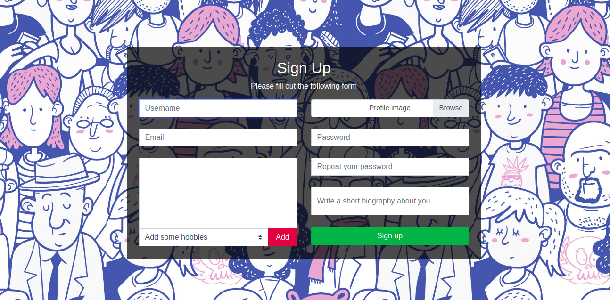
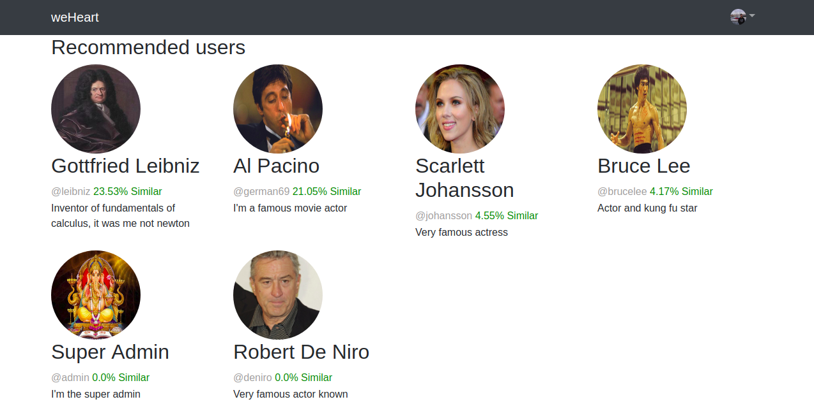

# weheart
Meet people based on similarities with you.

# Dependencies 

* python 3.7
* django 2.1.2 
* Dandelion API

# Instalation 

Install python 3.7 (I'm not sure if it  works with version py2) since 
I used django2x for this project.

Install django: 

In my case I used a virtual environment to install django

If your already have python3 pip & virtualenv installed on your computer you can omit this step 
```sudo apt update ```
``` sudo apt install python3-dev python3-pip```
```sudo pip3 install -U virtualenv ```

Then create a virtual environment
```virtualenv --system-site-packages -p python3 ./env```
Finally activate .env
```source ./env/bin/activate```

Once is activated you can install django as usual

```pip install django```

# API Usage

Programming text similarities from scratch can be though, so I used Dandelion API for making text similarities between users (Biographies). 
You can get a free account from here https://dandelion.eu/. 
Queries can be made pretty easy, as explained in the web page from above. An example of text similarity usage
in this project is the one from above. 

```
token = <YOUR_TOKEN_HERE>
url = "https://api.dandelion.eu/datatxt/sim/v1/"
texto1 = actual_user.userprofile.biography
texto2 = user.userprofile.biography
dict_data = {"text1": texto1, "text2" : texto2,"lang" : "en", "token" : token}
dict_data = json.dumps(dict_data)
loaded_r = json.loads(dict_data)
r = requests.post(url, data=loaded_r)
return (r.json()['similarity'])
``` 

Have fun making some queries.

# Screenshots

Login & register page:


Image Source "https://www.freepik.es/fotos-vectores-gratis/musica"


Image Soruce "https://www.freepik.es/fotos-vectores-gratis/fondo"

Dashboard (not finished):

