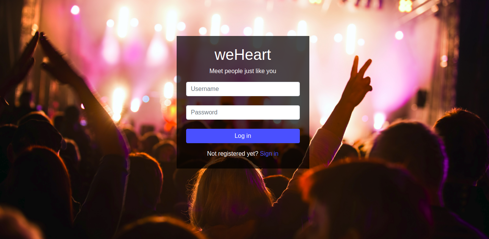

# weheart
Meet people based on similarities with you.

# Dependencies 

* python 3.7
* django 2.1.2 

# Instalation 

Install python 3.7 (I'm not sure if it  works with version py2) since 
I used django2x for this project.

Install django: 

In my case I used a virtual environment to install django

If your already have python3 pip & virtualenv installed on your computer you can omit this step 
```sudo apt update ```
``` sudo apt install python3-dev python3-pip```
```sudo pip3 install -U virtualenv ```

Then create a virtual environment
```virtualenv --system-site-packages -p python3 ./env```
Then activate .env
source ./env/bin/activate

Once is activated you can install django as usual

```pip install django```


# Screenshots

Login & register page:


Image Source "https://www.freepik.es/fotos-vectores-gratis/musica"


Image Soruce "https://www.freepik.es/fotos-vectores-gratis/fondo"

Dashboard (not finished):

